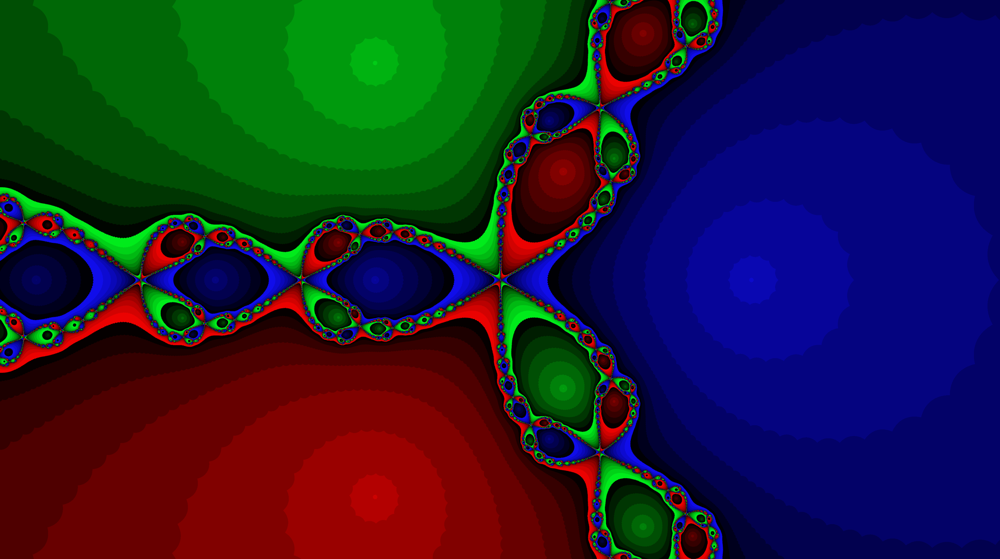
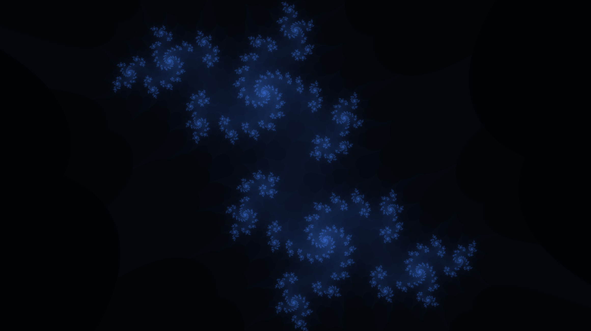
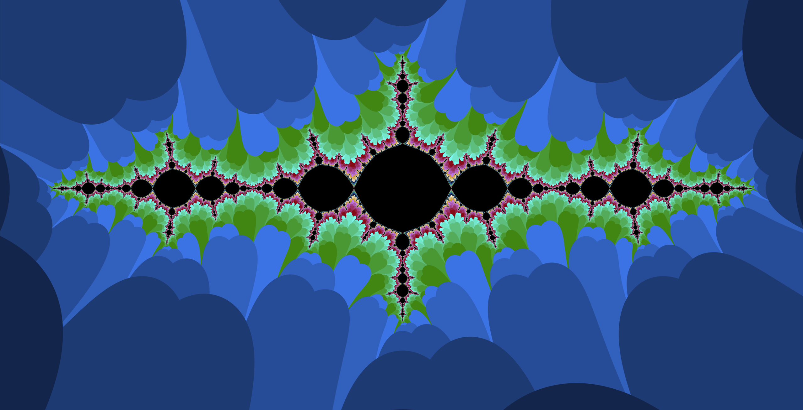
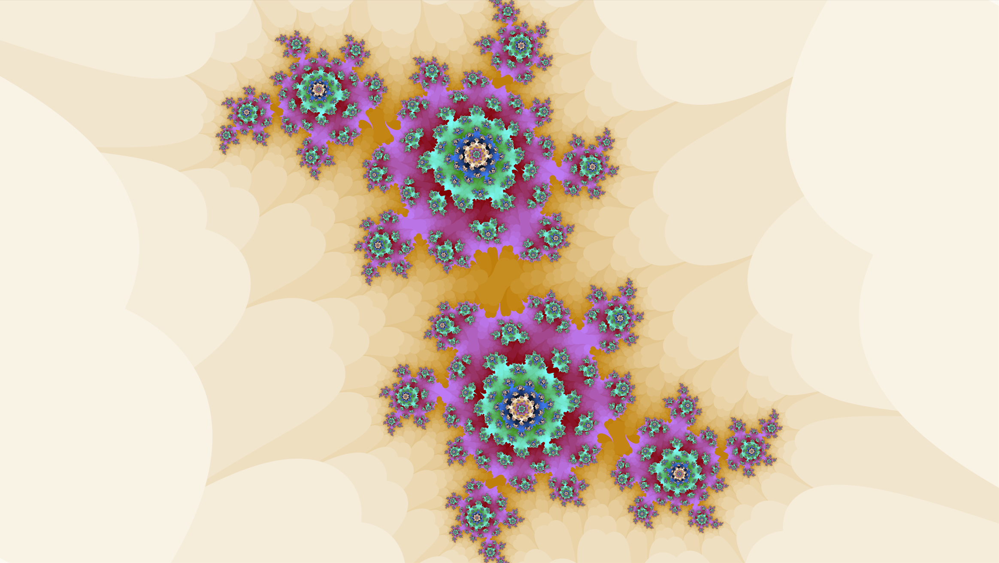

# Bitmap Image Processing Library with Alexandre Allaire

## Overview
A C# library for BMP image processing and manipulation with Huffman compression algorithm integration. This project provides various image filters, transformations, and fractal generation capabilities.

## Features
- **Image Processing**
  - Grayscale conversion (standard and weighted)
  - Multiple edge detection algorithms
  - Blur filters (uniform and Gaussian)
  - Border enhancement and embossing effects
  - Image rotation and scaling

- **Steganography**
  - Hide images within other images
  - Extract hidden images

- **Fractal Generation**
  - Julia set fractals
  - Mandelbrot set
  - Newton fractals with customizable functions

- **Compression**
  - Huffman coding implementation for image compression
  - Saving and loading compressed images

  ## Best Fractals
    Here are our 5 best fractal images generated using this library. For more examples, please see the image gallery included with the project.

## Implementation Notes
* The Huffman compression algorithm creates a frequency table for color values, builds a Huffman tree, and encodes pixel values.
* Fractal generation uses complex number math to create visually stunning mathematical patterns.
* Image processing algorithms work directly with RGB pixel data in memory.